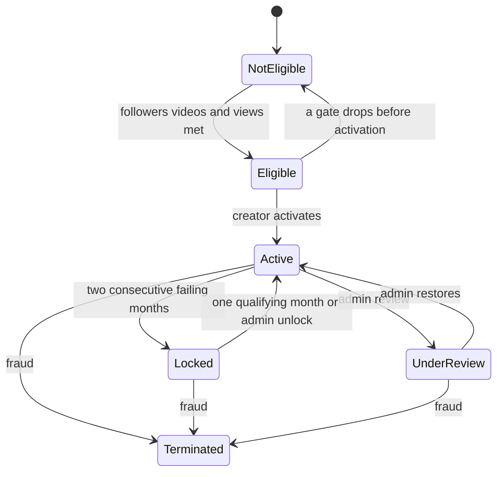

# Creator Monetization Program

The PDF is a **view-based earnings program** for a creator’s own TAATOM account. It is not Connect subscription revenue and not the existing long-video upload application (`videoCreatorStatus`). Those stay as they are.

The only fixed money figure in the document is a **minimum withdrawal of 1000 rs**. The earnings examples use a placeholder rate (`£X` per 1,000 views) that TAATOM sets from its revenue. Amounts are stored and shown in **INR**. SuperAdmin sets the rupee rate per 1,000 eligible views. Calendar months use **Asia/Kolkata**.

## What counts

- **Eligible video:** a `Post` with `type` `short` or `long_video`, `status: active`, not hidden, archived, flagged, or removed. Photos do not count. `source: 'youtube'` does not count unless SuperAdmin marks that video eligible.
- **Account in good standing** (section 19): user is verified and not banned. A monetization status of `terminated` or `under_review` blocks new earnings.
- **Monthly views:** all view events recorded that month.
- **Eligible views:** the subset that passes section 5. Earnings use only these.
- A view is eligible only when it is a logged-in user, not the video owner, not a banned or unverified account, the viewer watched at least 1 second, and that user has not already produced an eligible view of that video. Same-user repeats, logged-out traffic, and the extra `getLongVideo` increment do not earn.
- Eligible views are stored in a new ledger. Lifetime `Post.views` stays the public counter and is not the payout source. Analytics events expire after 90 days, so they cannot be the ledger.

## Status rules (sections 2, 3, 6–9, 15)

- **Not Eligible:** missing 100 followers, 4 eligible videos this month, 2,000 eligible views this month, or good standing.
- **Eligible:** all gates pass. The creator must open **Profile → Creator Dashboard → Monetization** and activate. Activation is not automatic.
- **Active:** new eligible views earn. A month fails if any of the three gates fail. Two consecutive failing months set **Locked**. A passing month resets the fail streak.
- **Locked:** no new earnings. Existing available balance can still be withdrawn unless an admin hold or fraud reversal applies. One later calendar month that again meets all three gates unlocks automatically. Admin can unlock or re-lock with a reason. The creator keeps the same account, followers, and videos.
- **Under Review:** admin pause. New earnings stop and withdrawals can be held. The dashboard shows the reason.
- **Terminated:** permanent stop from section 14. Admin only. Previous available balance can be reversed when fraud is confirmed.

Thresholds, the INR rate, the ₹1000 minimum, “2 failing months to lock”, and “1 qualifying month to unlock” live in SuperAdmin settings so section 18 changes do not need a code deploy.

## Earnings and balances (sections 4, 10–12)

- Formula: `(eligible views ÷ 1,000) × rate`, rounded to 2 decimal rupees. 2,500 eligible views at ₹10 per 1,000 = ₹25.00.
- **This month’s earnings** stay **Pending** until the month-close job validates them.
- After validation they move to **Available**.
- A withdrawal request immediately reduces Available and sits in **Withdrawn** history as requested, on hold, processing, paid, or rejected. Rejection returns the amount to Available.
- Minimum request is **₹1000**. Below that, the button explains the shortfall.
- Before the first withdrawal the creator must submit legal name, an approved method (Indian bank account or UPI, same fields already used on Connect pages), and tax or identity details. SuperAdmin marks verification `pending`, `verified`, or `rejected`. Unverified creators cannot withdraw. Admin can place a temporary hold (section 11).
- Payout execution matches Connect: SuperAdmin marks the withdrawal paid with a reference (UTR or UPI id). No new payment gateway.

## Invalid views and prohibited activity (sections 5, 13, 14)

SuperAdmin can exclude a video, void eligible views, reverse pending or available earnings, lock, hold, or terminate. Every action stores a reason. The creator sees that reason on the dashboard (section 17). Policy text for original content, community guidelines, copyright, and the prohibited list (bought views, bots, fake accounts, view exchanges, bug abuse) is shown in the dashboard and in Help on both clients.

## Month-close job

Nothing monthly runs today (`calculateMonthlyPayouts` is never scheduled). Add a daily job in [backend/src/server.js](backend/src/server.js):

- Each eligible view updates the open month ledger.
- On the first run after a Kolkata month ends: validate that month, move pending to available, score pass or fail for Active creators, lock on the second consecutive fail, and auto-unlock a Locked creator who just completed one qualifying month.
- Admin adjustments after close rewrite the ledger and balances with an audit row.

## Backend

New models next to [backend/src/models/Payout.js](backend/src/models/Payout.js):

- `CreatorProgramSettings` — thresholds, INR rate, withdrawal minimum, lock and unlock month counts, whether tax or identity is required, policy version.
- `CreatorMonetization` — user, status, activatedAt, consecutiveFailMonths, payout profile, verification status, pending, available, withdrawn totals, lock or review reason.
- `CreatorMonthLedger` — user, year-month, followers snapshot, eligible video count, monthly views, eligible views, earnings, pass or fail, pending or settled.
- `CreatorEligibleView` — user, viewer, post, month. Unique on viewer + post.
- `CreatorEarningAdjustment` — admin delta, reason, actor.
- `CreatorWithdrawal` — amount, method, status, hold reason, payout reference, processor.

Creator API under `/api/v1/creator-monetization`:

- `GET /dashboard` — every field in sections 3, 12, 16, and 17: status, followers `n / 100`, videos this month `n / 4`, monthly views `n / 2,000`, eligible views, rate per 1,000, this month’s earnings, pending, available, withdrawn, lock or review reason, program notices.
- `POST /activate`
- `PUT /payout-profile` and `POST /verification`
- `POST /withdrawals` and `GET /withdrawals`

Record eligible views from the existing `post_view` path in [backend/src/controllers/analyticsController.js](backend/src/controllers/analyticsController.js) only. Do not add a second increment in `getLongVideo`.

Admin API under `/api/v1/superadmin/creator-monetization` (`canManageContent`): settings, creator list and detail, set status with reason, exclude or include a video, adjust earnings, verification queue, withdrawal queue (hold, reject, mark paid).

On a settings or policy change, notify creators in `eligible`, `active`, `locked`, or `under_review` through `Notification.createNotification`.

## Mobile

New route `frontend/app/creator-monetization.tsx`, opened from the profile menu in [frontend/app/(tabs)/profile.tsx](frontend/app/(tabs)/profile.tsx) as **Creator Dashboard**.

One screen, matching section 16:

- Status badge
- Progress rows for followers, videos this month, and monthly views
- Eligible views, earnings rate, this month’s earnings, pending, available, withdrawn
- Activate when status is Eligible
- Withdraw when Active or Locked, available balance is at least ₹1000, and verification is approved
- Payout and identity form, withdrawal history, lock or review reason, and the program rules (sections 5, 13, 14, 20)

Add a short FAQ in [frontend/app/support/help.tsx](frontend/app/support/help.tsx). Do not put these numbers on Connect payouts.

## Web

Same dashboard at `web/app/(dashboard)/creator-monetization/page.tsx`.

- Link it from [web/components/profile/profile-actions.tsx](web/components/profile/profile-actions.tsx) on your own profile.
- Add it to [web/components/settings/settings-nav-config.ts](web/components/settings/settings-nav-config.ts).
- Add the same FAQ on [web/app/(dashboard)/help/page.tsx](web/app/(dashboard)/help/page.tsx).

The page is login-only, like the rest of the dashboard, so it stays out of the public sitemap.

## SuperAdmin

New page `SuperAdmin/src/pages/CreatorMonetization.jsx` at `/creator-monetization`, linked from [SuperAdmin/src/components/Sidebar.jsx](SuperAdmin/src/components/Sidebar.jsx). Do not add it under Subscriptions or Video Creators.

Tabs:

- **Settings** — every threshold, INR rate, ₹1000 minimum, lock and unlock month counts, payment methods, policy text. Saving notifies creators.
- **Creators** — status, the three gates, eligible views, balances, actions for review, lock, unlock, terminate, and a reason.
- **Videos** — mark a short or long video ineligible or eligible, with a reason.
- **Verification** — approve or reject identity and tax details.
- **Withdrawals** — hold, reject, or mark paid with a reference.
- **Adjustments** — add or remove earnings and invalid views, with an audit trail.

## Out of scope

- Connect subscription payouts, Cashfree checkout, and the long-video creator application stay unchanged.
- No automatic bank transfer. Payment stays a manual mark-paid step, with the creator told that timing depends on the bank, verification, and holidays.
