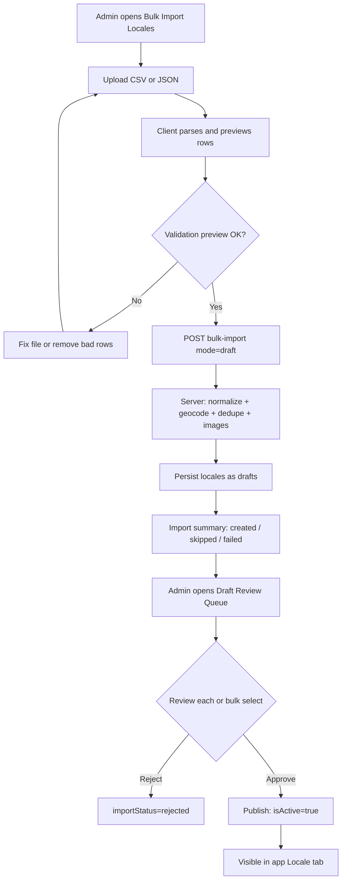
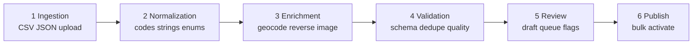
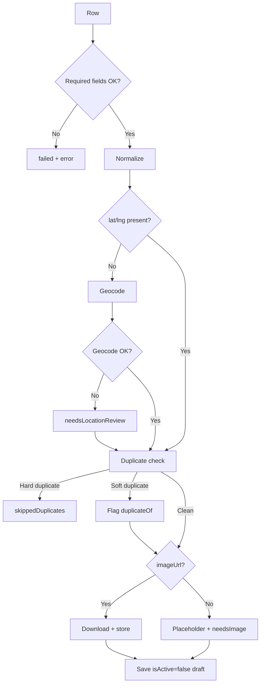
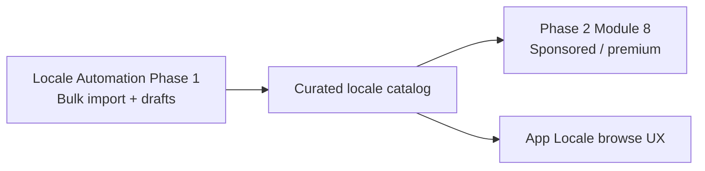

# Taatom — Locale Automation System Design

| Field | Value |
| --- | --- |
| Project | Taatom Locale Automation (Phase 1) |
| Location | `Tool/Rooted/Code/Day-2/design` |
| Sources | Locale-Automation-Plan, Locale-Automation-Estimate-Client, Taatom-Phase2-Effort-Quotation (Module 8 context) |
| Date | 19 July 2026 |
| Status | Design — ready for implementation |
| Effort basis | 17 person-days / ~3 weeks / quote ₹ 42,000 |

---

## 1. Purpose

This design defines the complete product and technical flow for **Locale Bulk Automation**: importing destinations from CSV/JSON, enriching them, detecting duplicates, storing them as drafts, and publishing only after SuperAdmin review.

It is the implementation blueprint for Phase 1 of Locale Automation. It does **not** replace Phase 2 product modules (feed, journey, promotions, etc.). Locale **monetization** (sponsored / premium) from Phase 2 Module 8 is noted as a follow-on that depends on this foundation.

---

## 2. Goals and Non-Goals

### Goals

- Upload hundreds or thousands of locales via structured files
- Auto-enrich missing coordinates and normalize fields
- Detect likely duplicates before create
- Never publish blindly — draft → review → publish
- Support remote image URL or placeholder so imports are not blocked by manual image upload
- Reuse existing Locale schema, SuperAdmin shell, geocoding helpers, and Sevalla/object storage

### Non-Goals (Phase 1)

- Blind world-wide crawling or scraping
- Live sync with Google Places / continuous OSM sync
- AI-generated descriptions
- Multilingual auto-translation
- Popularity ranking / sponsored locale placement (Phase 2 Module 8)
- Replacing one-by-one manual create (manual create remains available)

---

## 3. Current Foundation (Code Reality)

| Area | Today | Gap |
| --- | --- | --- |
| Locale model | Rich fields: name, country, codes, city, coords, spotTypes, travelInfo, gallery keys, `isActive` | No import batch / review metadata |
| SuperAdmin | Manual create + map POI discovery (OSM), one-by-one submit | No bulk import UI or draft queue |
| API | `POST /api/v1/locales/upload` (multipart, image required) | No bulk draft import endpoint |
| Maps | Geocode / reverse-geocode helpers exist | Not wired into batch enrichment |
| Monetization | Browse/filter only | Phase 2 Module 8 (sponsored / premium) after automation |

---

## 4. System Context

```text
┌─────────────────┐     CSV/JSON      ┌──────────────────┐
│ Ops / Curators  │ ───────────────►  │ SuperAdmin       │
│ (datasets)      │                   │ Bulk Import UI   │
└─────────────────┘                   └────────┬─────────┘
                                               │ HTTPS
                                               ▼
                                      ┌──────────────────┐
                                      │ Backend API      │
                                      │ bulk-import +    │
                                      │ review/publish   │
                                      └────────┬─────────┘
                       ┌───────────────────────┼───────────────────────┐
                       ▼                       ▼                       ▼
              ┌────────────────┐     ┌────────────────┐     ┌────────────────┐
              │ MongoDB Locale │     │ Geocoding      │     │ Object Storage │
              │ (+ import meta)│     │ (Maps helpers) │     │ (Sevalla / S3) │
              └────────────────┘     └────────────────┘     └────────────────┘
                       │
                       ▼
              ┌────────────────┐
              │ Mobile / Web   │
              │ Locale tab     │
              │ (published     │
              │  isActive only)│
              └────────────────┘
```

---

## 5. End-to-End User Flow

### 5.1 Happy path



### 5.2 Admin steps (product)

1. Open **Bulk Import Locales** in SuperAdmin
2. Download / use CSV template
3. Upload file → preview table with per-row errors
4. Confirm import → backend processes batch
5. View import summary (created / duplicates / failed)
6. Open **Locale Drafts** filtered by `importBatchId`
7. Fix flags (`needsImage`, `needsLocationReview`, duplicate warnings)
8. **Publish** selected rows (single or bulk)
9. Confirm live in mobile/web Locale browse

### 5.3 Operational data path (ops)

1. Source dataset by country/city/category (not whole world at once)
2. Optional local preprocess (ISO codes, spot-type map, dedupe)
3. Upload cleaned file into SuperAdmin
4. Import as drafts only
5. Human review → publish

---

## 6. Architecture Layers



| Layer | Responsibility |
| --- | --- |
| Ingestion | Accept file or row array; parse CSV/JSON; attach `importBatchId` |
| Normalization | Trim strings; ISO country; split spotTypes; round coords to 3 decimals; map travelInfo |
| Enrichment | Geocode if lat/lng missing; optional reverse address; fetch remote image → storage |
| Validation | Required fields; ranges; taxonomy; duplicate rules; image policy |
| Review | SuperAdmin queue; filters; publish / reject |
| Publish | Set `isActive=true` and `importStatus=published`; app reads published only |

---

## 7. Data Model Extensions

Keep existing Locale fields. Add import/review metadata (additive):

| Field | Type | Purpose |
| --- | --- | --- |
| `importSource` | string | e.g. `csv`, `json`, `manual` |
| `importBatchId` | string / ObjectId | Groups one upload run |
| `importStatus` | enum | `draft` \| `reviewed` \| `published` \| `rejected` |
| `needsImage` | boolean | Draft missing real image |
| `needsLocationReview` | boolean | Geocode low confidence or missing city/state |
| `duplicateOf` | ObjectId ref | Link to existing locale if soft-duplicate |
| `sourceId` | string optional | External id for future adapters |
| `createdBy` | existing | Admin user id |

### Publish rules

| State | `isActive` | `importStatus` | App visible |
| --- | --- | --- | --- |
| Fresh import | `false` | `draft` | No |
| Rejected | `false` | `rejected` | No |
| Published | `true` | `published` | Yes |
| Manual create (unchanged) | as today | optional `manual` / null | As today |

---

## 8. CSV / JSON Contract

### 8.1 Required columns

`name`, `country`, `countryCode`, `city`

### 8.2 Optional columns

`stateProvince`, `stateCode`, `description`, `spotTypes`, `travelInfo`, `latitude`, `longitude`, `imageUrl`, `displayOrder`, `sourceId`

### 8.3 Example CSV row

```csv
name,country,countryCode,stateProvince,stateCode,city,description,spotTypes,travelInfo,latitude,longitude,imageUrl
Eiffel Tower,France,FR,Ile-de-France,IDF,Paris,Iconic landmark,"Historical spots|Viewpoints",Walkable,48.8584,2.2945,https://example.com/eiffel.jpg
```

### 8.4 Spot type mapping (preprocess or server)

| Source tag | Taatom `spotTypes` |
| --- | --- |
| museum | Historical spots |
| viewpoint | Viewpoints |
| beach | Beaches |
| temple | Religious places |
| park | Nature |
| castle | Historical spots |
| waterfall | Nature |
| market | Local experience |

### 8.5 `travelInfo` enum (existing)

`Drivable` | `Walkable` | `Public Transport` | `Flight Required` | `Not Accessible`

---

## 9. API Design

Base prefix: `/api/v1` (SuperAdmin auth required).

### 9.1 Bulk import

`POST /api/v1/locales/bulk-import`

```json
{
  "mode": "draft",
  "rows": [
    {
      "name": "Eiffel Tower",
      "country": "France",
      "countryCode": "FR",
      "stateProvince": "Ile-de-France",
      "city": "Paris",
      "description": "Iconic landmark",
      "spotTypes": ["Historical spots", "Viewpoints"],
      "travelInfo": "Walkable",
      "latitude": 48.8584,
      "longitude": 2.2945,
      "imageUrl": "https://example.com/eiffel.jpg"
    }
  ]
}
```

Alternate: multipart file upload (`file` = CSV/JSON) parsed server-side; same processing pipeline.

**Response**

```json
{
  "importBatchId": "batch_20260719_01",
  "created": 820,
  "skippedDuplicates": 118,
  "failed": 42,
  "errors": [{ "row": 14, "reason": "Missing city" }]
}
```

### 9.2 List drafts / review

`GET /api/v1/locales/import/drafts?batchId=&countryCode=&needsImage=&page=&limit=`

### 9.3 Publish / reject

`POST /api/v1/locales/import/publish`

```json
{ "localeIds": ["..."], "action": "publish" }
```

`action`: `publish` | `reject`

### 9.4 Per-row processing algorithm



---

## 10. Duplicate and Quality Rules

| # | Rule | Action |
| --- | --- | --- |
| 1 | Exact match `normalized name + countryCode + city` | Skip (hard duplicate) |
| 2 | Same normalized name + `countryCode` + coords within ~0.5 km | Soft flag `duplicateOf` / warn |
| 3 | Missing `countryCode` or `city` | Fail row |
| 4 | Invalid lat/lng ranges | Fail row |
| 5 | Unknown `travelInfo` / spot type | Fail or map to nearest allowed |
| 6 | Same `importBatchId` re-applied | Idempotent reject or no-op |
| 7 | Coords | Round to 3 decimals (existing upload behavior) |

---

## 11. Image Strategy

| Case | Behavior |
| --- | --- |
| Valid `imageUrl` | Fetch → upload to Sevalla/object storage → set primary key |
| No image | Placeholder asset + `needsImage=true` (draft still created) |
| Fetch failure | Placeholder + `needsImage=true` + warning in row result |

Manual create flow can keep image-required behavior. Bulk **draft** import uses the relaxed policy above.

---

## 12. SuperAdmin UI Design

### 12.1 Screen: Bulk Import Locales

- File picker (CSV / JSON)
- Template download link
- Preview table: row #, name, country, city, coords, image status, errors
- Primary CTA: **Start Import**
- Result panel: counts + downloadable error list

### 12.2 Screen: Draft Review Queue

- Filters: batch, country, `needsImage`, `needsLocationReview`, status
- Columns: name, location, flags, duplicate, createdAt
- Actions: Open detail, Publish, Reject, Bulk Publish / Reject
- Detail: map pin, images, edit fields before publish (reuse existing edit where possible)

### 12.3 Navigation

Add entries under Locales:

- Locales (existing)
- Bulk Import
- Drafts / Review

---

## 13. Implementation Workstreams (from estimate)

| # | Module | Days |
| --- | --- | --- |
| 1 | Bulk import backend API + validation engine | 4 |
| 2 | CSV/JSON parser + normalization | 2 |
| 3 | SuperAdmin bulk import UI + preview | 3 |
| 4 | Draft / review workflow in admin | 2 |
| 5 | Duplicate detection + quality checks | 2 |
| 6 | Image strategy (URL / placeholder / missing flag) | 2 |
| 7 | QA, sample datasets, fixes | 2 |
| | **Total** | **17** |

### Suggested calendar

| Week | Focus |
| --- | --- |
| 1 | API, parser, normalization, validation |
| 2 | SuperAdmin UI, draft review, duplicates |
| 3 | Images, QA, pilot country import, deploy |

---

## 14. Relationship to Phase 2 Quotation

| Phase 2 item | Relationship |
| --- | --- |
| Module 8 Locale Monetization | Builds **after** locales can be seeded at scale; sponsored placements and premium gating assume a healthy locale catalog |
| Other Phase 2 modules (feed, journey, ranking, etc.) | Independent; not part of this design |
| Locale Automation quote | Standalone ₹ 42,000 / 17 days — separate from Phase 2 ₹ 1,05,000 package |



---

## 15. Future Phases (Out of Scope Now)

Documented for clarity only:

- Map multi-select OSM bulk import (city seeding)
- Scheduled country-wise ingest adapters
- Smarter taxonomy / popularity scoring
- Sponsored locale ingestion controls (with Module 8)

---

## 16. Assumptions and Risks

### Assumptions

1. Locale schema remains mostly additive
2. SuperAdmin shell is reused
3. Phase 1 source is CSV/JSON only
4. Client provides sample datasets and image licensing policy
5. Draft status can ship without full product redesign

### Risks and mitigations

| Risk | Mitigation |
| --- | --- |
| Image copyright | Client-approved URLs only; placeholder when missing |
| Duplicate flood | Hard + soft dedupe; draft review before publish |
| Performance | Import by country/batch; monitor Locale queries |
| Blind publish | Default `mode=draft`; no auto-activate |

---

## 17. Acceptance Criteria

1. Admin can upload CSV/JSON and see a preview with validation errors
2. Import creates draft locales (`isActive=false`) with `importBatchId`
3. Missing coords are geocoded when possible; otherwise flagged
4. Hard duplicates are skipped; soft duplicates are flagged
5. Remote images ingest to storage; missing images use placeholder + `needsImage`
6. Draft queue supports filter, publish, reject (including bulk)
7. Published locales appear in the app Locale experience
8. Pilot import of a sample country dataset completes with a clear summary report

---

## 18. Traceability

| Design section | Source document |
| --- | --- |
| Goals, deliverables, quote, timeline | Locale-Automation-Estimate-Client.md |
| Schema constraints, options A/B/C, API sketch, image strategy | Locale-Automation-Plan.md |
| Monetization follow-on, platform context | Taatom-Phase2-Effort-Quotation.md (Module 8) |

---

## 19. Sign-Off

| Role | Name | Date |
| --- | --- | --- |
| Product / Client | | |
| Engineering | | |
| Design ready for build | | |
