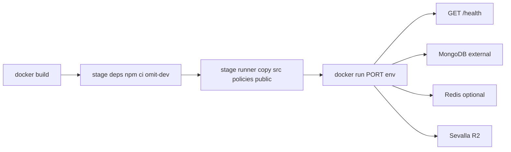

# Backend Docker Architecture Report

Analysis-first dockerization for the Taatom Express API. **No application logic, routes, or auth changes** were required — health endpoints already exist and the process already binds `0.0.0.0`.

---

## 1. Stack

| Item | Detail |
|------|--------|
| Framework | Express `^4.22.2` (JavaScript CommonJS) |
| Language | **No TypeScript** — no `tsconfig`, no transpile, no `dist/` |
| Node | `engines.node: ">=18"`; [`.nvmrc`](.nvmrc) pins **18** |
| Package manager | npm (`package-lock.json`) |
| Entry | `npm start` → `node src/server.js` |

### Startup sequence

```text
npm start → node src/server.js
  → dotenv.config()
  → validateEnvironment()   // requires MONGO_URL, JWT_SECRET, NODE_ENV
  → force NODE_ENV=production if STAGING/PRODUCTION/DEPLOY_ENV set
  → Sentry (instrument.js)
  → require('./app') → connectDB (mongoose)
  → optional jobs/workers (no-op queues today)
  → await Mongo → http.createServer(app) → setupSocket(server)
  → listen(PORT || 5000, '0.0.0.0')
  → setInterval jobs (journey auto-end, Cashfree poll, FX warm)
```

Key files: `src/server.js`, `src/app.js`, `src/socket/index.js`.

### Scripts (Docker must match these — do not invent `build`)

| Script | Command |
|--------|---------|
| `start` | `node src/server.js` |
| `dev` | `nodemon src/server.js` |
| **No `build`** | — |

---

## 2. Ports & health

- HTTP + Socket.IO share **`PORT`** (code default **5000** if unset). Dockerfile sets `PORT=3000` and `EXPOSE 3000`; override at runtime as needed.
- Bind address is already **`0.0.0.0`** (cloud-agnostic).
- Existing health routes (used as-is — **no new `/health` route**):
  - `GET /health`, `/health/live`, `/health/ready`, `/health/detailed`
  - Also under `/api/v1/health/*`
- Defined in `src/routes/healthRoutes.js` / `src/controllers/healthController.js`.

---

## 3. External services inventory

| Service | Status |
|---------|--------|
| MongoDB (mongoose) | **Required** at boot (`MONGO_URL`) |
| JWT | **Required** (`JWT_SECRET`) |
| Redis (ioredis) | Optional; falls back to in-memory if unset |
| Sevalla / R2 (`@aws-sdk` S3) | Primary media storage |
| Cloudinary | Legacy / helpers |
| Firebase Admin + Expo push | Optional (Expo uses public HTTP API; no Expo env key required) |
| Google OAuth + Maps REST | Optional |
| Cashfree (HTTPS, no SDK) | Optional |
| Brevo email (REST) | Optional (critical for SuperAdmin 2FA) |
| Sentry | Optional |
| Socket.IO | Same HTTP port; **production requires `WS_ALLOWED_ORIGIN`** |
| Bull / BullMQ / cron | Not used (stubs + `setInterval`) |
| Stripe / Razorpay / OpenAI / Gemini | Not present |

---

## 4. Uploads & filesystem

- Multer uses **`memoryStorage()`** everywhere.
- Video temps use `os.tmpdir()` with `@ffmpeg-installer` / `@ffprobe-installer`.
- No local `uploads/` directory required.
- `public/` exists (e.g. `.well-known/assetlinks.json`) but is **not** mounted via `express.static` — serve via reverse proxy or host separately if needed.
- Container needs a writable `/tmp` (default in the image).

---

## 5. Docker readiness notes (documented, not “fixed” in app code)

- Redis defaults to `127.0.0.1` if `REDIS_URL` / host unset — set Redis env for multi-replica rate limits / cache.
- Prod Socket.IO throws without `WS_ALLOWED_ORIGIN`.
- In-process `setInterval` jobs duplicate across multi-replica deployments.
- FFmpeg installers prefer **glibc** (Debian slim), not Alpine musl.

---

## 6. Image layout (what is copied)

| Copied into image | Purpose |
|-------------------|---------|
| `package.json`, `package-lock.json` | scripts + deps metadata |
| `node_modules` (prod only) | from multi-stage `npm ci --omit=dev` |
| `src/` | application |
| `policies/` | policy markdown assets |
| `public/` | static well-known assets |

**Not** copied: `.env*`, secrets, tests, coverage, git, docs noise (see `.dockerignore`).

---

## 7. Build & run commands

```bash
cd backend

# Build
docker build -t taatom-backend:latest .

# Run (map host 3000 → container 3000; inject secrets via --env-file)
docker run --rm -p 3000:3000 --env-file .env \
  -e PORT=3000 \
  -e NODE_ENV=production \
  -e WS_ALLOWED_ORIGIN=https://your-frontend.example \
  taatom-backend:latest
```

Verify:

```bash
curl -fsS http://127.0.0.1:3000/health
# optional: /health/live, /health/ready, /health/detailed
```

Minimum boot env (also enforced by `validateEnvironment()`):

- `NODE_ENV=production`
- `MONGO_URL=...`
- `JWT_SECRET=...`
- `WS_ALLOWED_ORIGIN=...` (required for Socket.IO in production)

See [`.env.example`](.env.example) for the full grouped inventory.

---

## 8. Docker decision rationale

| Decision | Why |
|----------|-----|
| No `npm run build` | There is no compile/transpile step; runtime is plain Node. |
| `node:18-bookworm-slim` | Matches `engines` / `.nvmrc`; **glibc** for FFmpeg native installers (avoid Alpine musl). |
| Multi-stage + `npm ci --omit=dev` | Smaller production image; reproducible lockfile install. |
| `CMD ["npm","start"]` | Matches existing production start path (`node src/server.js`). |
| `HEALTHCHECK` → `GET /health` | Uses existing basic health endpoint; no new routes. |
| Bind `0.0.0.0` | Already in app code — works on EC2, ECS, Cloud Run, Railway, etc. |
| Non-root user | Runs as image `node` user after install. |
| No secrets in image | Env injected at runtime (`--env-file` / platform secrets); `.env*` in `.dockerignore`. |
| Writable `/tmp` | Video transcoder temp files via `os.tmpdir()`. |
| `EXPOSE 3000` + `ENV PORT=3000` | Common container convention; code default remains 5000 if `PORT` unset outside Docker. |



---

## 9. Explicit non-goals (confirmed)

- No Express / routing / auth / business logic changes
- No TypeScript migration
- No inventing env vars not present in code (documented-but-unused ops keys are noted in `.env.example`)
- No committing real secrets
- **Application logic change count: zero**

## 10. EC2 production packaging (follow-up)

See [EC2_DOCKER_DEPLOYMENT.md](./EC2_DOCKER_DEPLOYMENT.md) for:

- `docker-compose.yml` (backend only; Atlas / Upstash external)
- Host `nginx.conf` (WebSocket + large uploads)
- GitHub Actions deploy with health check + rollback
- Manual `docker compose` / logs / health verification
